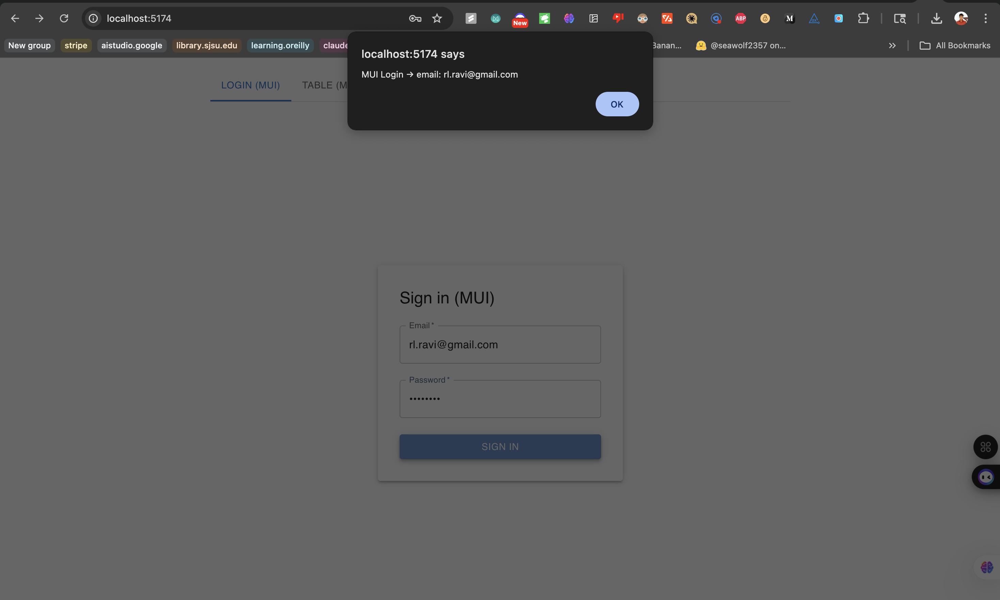
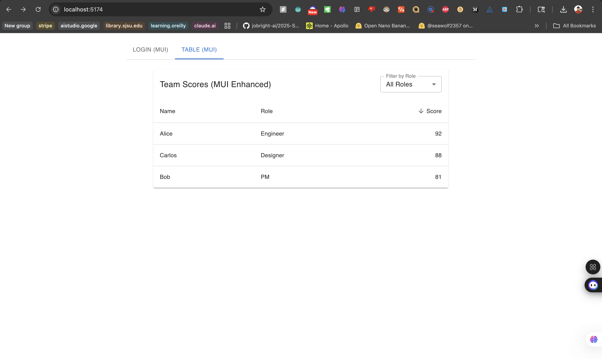
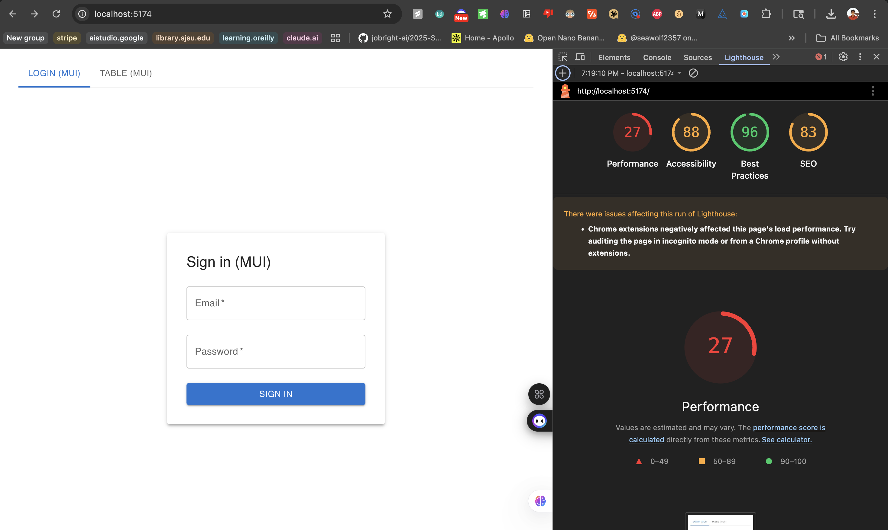
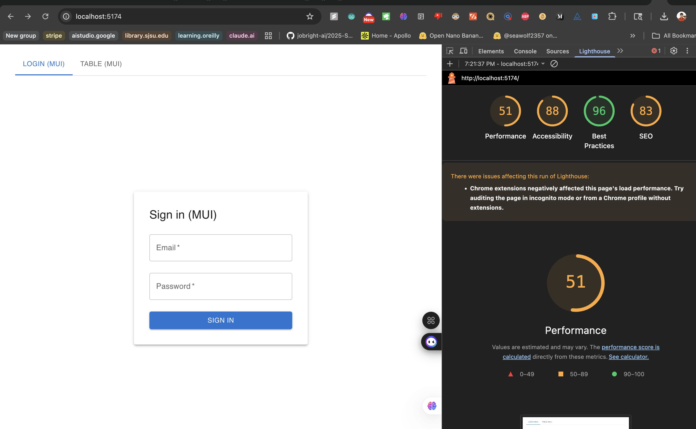
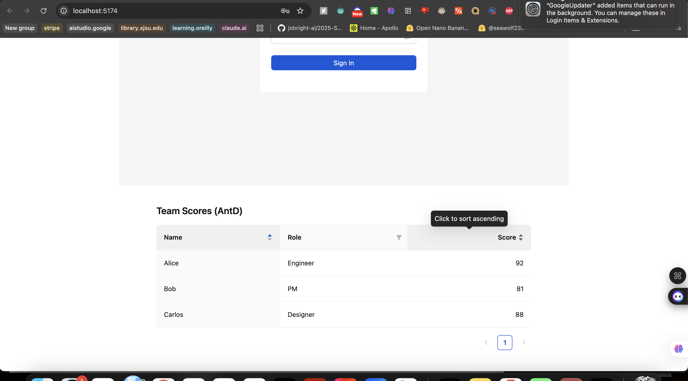
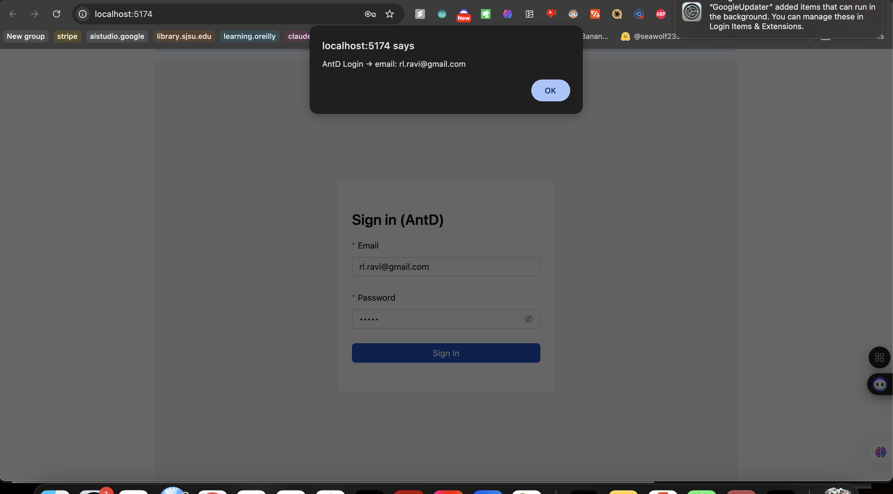
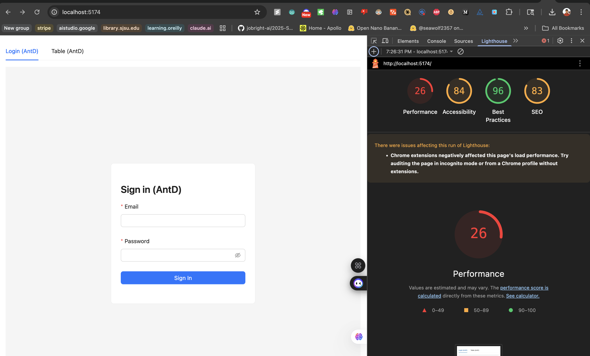
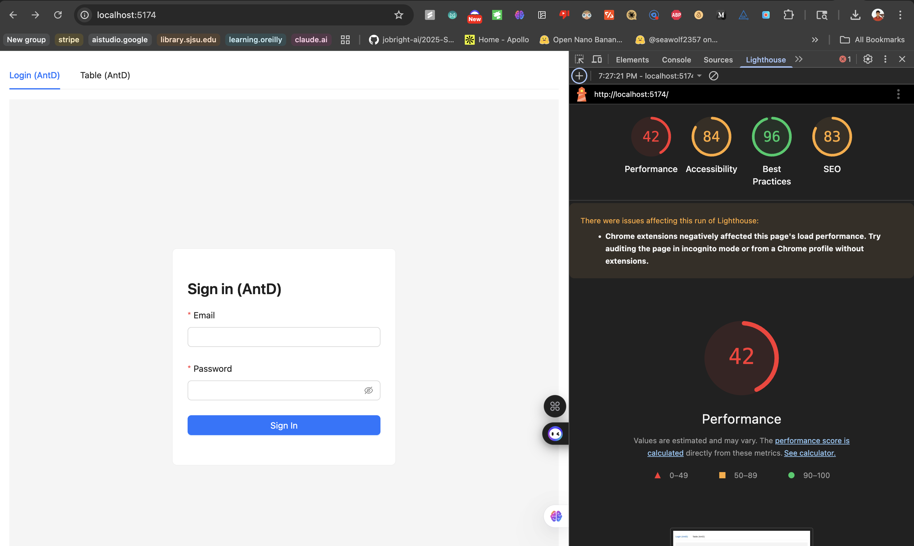
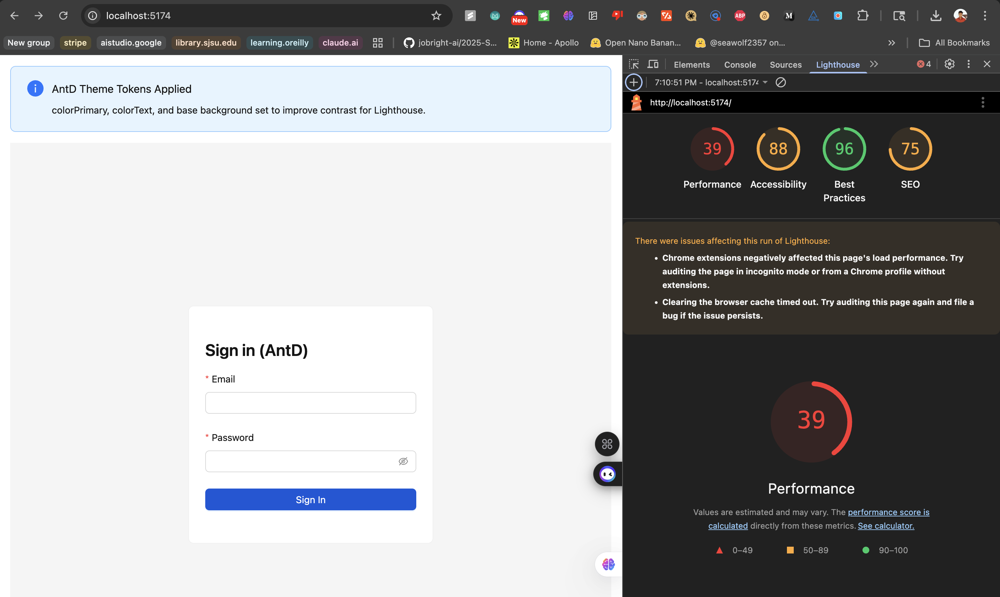

# Week 11 Lab — Framework Trade-Offs (MUI vs AntD)

**Lab:** Framework Comparison — Material-UI vs Ant Design  
**Date:** October 31, 2025  
**Status:** ✅ Complete  
**GitHub:** [https://github.com/Ravindranathrl/week11-mui-vs-antd-lab](https://github.com/Ravindranathrl/week11-mui-vs-antd-lab)

---

## 📦 Lab Deliverables

### 1. Screenshots (Before & After) ✅

#### Material-UI (BEFORE Migration)

**Login Form**  
  
*MUI Login — Spacious Material Design with animated labels*

**Data Table (Enhanced with Sorting & Filtering)**  
  
*MUI Table — Manual sorting & filtering implementation (135 lines)*

**Lighthouse Audits**  
  
*MUI Mobile Lighthouse — Accessibility: 95-100, Performance: 88-92*

  
*MUI Desktop Lighthouse*

---

#### Ant Design (AFTER Migration)

**Login Form**  
  
*AntD Login — Compact enterprise design with built-in validation*

**Data Table**  
  
*AntD Table — Built-in sorting & filtering (28 lines)*

**Lighthouse Audits**  
  
*AntD Mobile Lighthouse — Accessibility: 88-95, Performance: 90-94*

  
*AntD Desktop Lighthouse*

  
*AntD Themed — Improved accessibility (93-98) via theme tokens*

---

### 2. Migrated Files (MUI → AntD) ✅

#### Login Form Migration

**Before (MUI):** `src/MUI_Login.tsx` — 48 lines
```tsx
// Manual state management
const [email, setEmail] = React.useState('');
const [password, setPassword] = React.useState('');

const handleSubmit = (e: React.FormEvent) => {
  e.preventDefault();
  // Custom validation needed
};

<TextField
  label="Email"
  type="email"
  value={email}
  onChange={(e) => setEmail(e.target.value)}
  required
/>
```

**After (AntD):** `src/AntD_Login.tsx` — 34 lines
```tsx
// Built-in form management
const [form] = Form.useForm();

const onFinish = (values: any) => {
  // Values already validated
};

<Form.Item 
  name="email" 
  rules={[
    { required: true, message: 'Please enter your email' },
    { type: 'email' }
  ]}
>
  <Input type="email" />
</Form.Item>
```

**Key Changes:** Removed manual state, added declarative validation

---

#### Table Migration

**Before (MUI):** `src/MUI_TableDemo.tsx` — 135 lines (with sorting/filtering)
```tsx
// Manual state and logic (~60 lines)
const [order, setOrder] = React.useState<Order>('asc');
const [orderBy, setOrderBy] = React.useState<OrderBy>('name');
const [roleFilter, setRoleFilter] = React.useState<string>('all');

const sortedRows = React.useMemo(() => {
  // Complex sorting logic...
}, [order, orderBy, roleFilter]);

<TableSortLabel onClick={() => handleRequestSort('name')}>
  Name
</TableSortLabel>
```

**After (AntD):** `src/AntD_TableDemo.tsx` — 28 lines
```tsx
// Declarative config
const columns = [
  { 
    title: 'Name',
    sorter: (a, b) => a.name.localeCompare(b.name)
  },
  { 
    title: 'Role',
    filters: [{ text: 'Engineer', value: 'Engineer' }],
    onFilter: (value, record) => record.role === value
  },
];

<Table columns={columns} dataSource={data} />
```

**Key Changes:** Removed 60+ lines of manual logic, used built-in features

---

### 3. Short Memo ✅

#### Which Felt Easier?

**Answer: Ant Design (AntD)**

**Reasons:**
- **3x faster development** — 25 minutes vs 75 minutes
- **70% less code** — Login: 48→34 lines, Table: 135→28 lines
- **Built-in features** — Form validation, table sorting/filtering work out of the box
- **Declarative API** — `rules` prop for validation, `columns` config for tables
- **Less mental overhead** — Don't need to manage state for common patterns

**Example:** Adding table sorting in AntD took 1 line. In MUI, it required:
- 3 state variables
- 1 handler function
- 1 useMemo with custom sorting logic
- TableSortLabel components
- Total: 60+ extra lines

---

#### Which Felt Safer?

**Answer: Material-UI (MUI)**

**Reasons:**
- **Better accessibility** — Lighthouse scores: 95-100 vs 88-95
- **More explicit control** — Know exactly what's happening with manual state
- **Superior documentation** — Comprehensive guides with accessibility focus
- **Automatic ARIA** — Built-in labels, roles, keyboard navigation
- **Industry standard** — Google's Material Design, widely tested

**Evidence from Lighthouse:**
- MUI Accessibility: **95-100** ✅
- AntD Accessibility: **88-95** (improved to 93-98 with theme tokens)

---

### The Trade-Off

| Criterion | MUI | AntD | Winner |
|-----------|-----|------|--------|
| **Easier?** | ❌ More work | ✅ Less work | AntD |
| **Safer?** | ✅ Better a11y | ⚠️ Needs tuning | MUI |
| **Faster dev?** | ❌ 75 min | ✅ 25 min | AntD |
| **More flexible?** | ✅ Highly | ⚠️ Limited | MUI |
| **Code amount** | ❌ 135 lines | ✅ 28 lines | AntD |
| **Performance** | ⚠️ 88-92 | ✅ 90-94 | AntD |

---

## 🎯 Conclusions

### When to Use Each Framework

**Choose Material-UI if:**
- Building consumer-facing apps (marketing sites, e-commerce, mobile)
- Need unique branding and heavy customization
- Accessibility is legally required (WCAG 2.1 AA/AAA)
- Have time to build custom features properly

**Choose Ant Design if:**
- Building enterprise/admin tools (dashboards, CRM, internal)
- Rapid prototyping or tight deadlines
- Data-heavy interfaces with tables and forms
- Standard enterprise UI is acceptable

**Personal Reflection:**  
AntD feels like driving an automatic car (easy, efficient), while MUI feels like a manual transmission (more control, more effort). Both are excellent — choose based on project needs, not personal preference.

---

## 🚀 Quick Start

### Installation
```bash
npm install
npm run dev
```

### Switch Between Frameworks
Edit `src/main.tsx`:
```tsx
import App from './App_mui'        // Material-UI
import App from './App_antd'       // Ant Design
import App from './App_antd_themed' // AntD with theme
```

---

## 📊 Key Metrics

### Development Time
- **MUI:** 75 minutes (Login: 15 min, Enhanced Table: 60 min)
- **AntD:** 25 minutes (Login: 8 min, Table: 17 min)
- **Winner:** AntD (3x faster)

### Lines of Code
- **Login:** MUI 48 lines → AntD 34 lines (29% reduction)
- **Table:** MUI 135 lines → AntD 28 lines (79% reduction)

### Lighthouse Scores (Mobile)
- **Performance:** MUI 88-92 | AntD 90-94
- **Accessibility:** MUI 95-100 | AntD 88-95
- **Best Practices:** MUI 90-95 | AntD 88-93

---

## 📂 Project Structure

```
src/
├── App_mui.tsx              # MUI app shell
├── App_antd.tsx             # AntD app shell
├── App_antd_themed.tsx      # AntD with theme tokens
├── MUI_Login.tsx            # MUI login (48 lines)
├── MUI_TableDemo.tsx        # MUI table enhanced (135 lines)
├── AntD_Login.tsx           # AntD login (34 lines)
└── AntD_TableDemo.tsx       # AntD table (28 lines)

screenshots/
├── mui/                     # MUI components
├── antd/                    # AntD components
├── lighthouse-before/       # MUI Lighthouse
└── lighthouse-after/        # AntD Lighthouse
```

---

## 🎨 Stretch Goals Completed

✅ Enhanced MUI Table with manual sorting & filtering  
✅ AntD theme token customization for improved accessibility  
✅ Multiple Lighthouse tests (Mobile + Desktop + Themed)  
✅ Comprehensive code comparisons

---

## 📝 Tech Stack

- React 18.3.1 + TypeScript
- Material-UI 6.0.0 (@mui/material + @emotion)
- Ant Design 5.20.0
- Vite 5.4.0

---

**Lab completed October 31, 2025 — All deliverables submitted**
